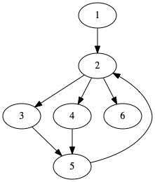
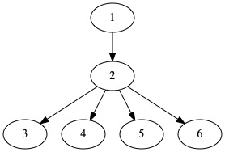
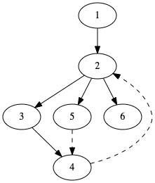

# Dominator tree 介绍

## 编译器优化最重要的数据结构之一

---
# 定义
Dom: 在一个有向图中，到达某个节点所必须经过的节点。
Dom（v） = u

---

 

 

---

# dominator tree 的基本构建算法

## 1 迭代方法
 
 每个节点的dom集合都初始化为自己，
 计算其所有前驱节点的dom，求交集，加入到自己的dom集合中。
 直到所有节点都不再变化
 
 问题
 复杂度高，不适合在不断的更新中使用

---

```
 // 开始节点的dom就是他自己
 Dom(n0) = {n0}
 // 其他节点开始的时候dom都设为自己
 for each n in N - {n0}
     Dom(n) = N;
 // 迭代循环求前驱节点的Dom的交集，直到没有变化
 while changes in any Dom(n)
     for each n in N - {n0}:
         Dom(n) = {n} union with intersection over Dom(p) for all p in pred(n)
```

---

| 1| 2| 3| 4| 5| 6|
| -| -| -| -| -| -|
| 1| 2| 3| 4| 5| 6|
| 1| 2,1|2,3|2,4|5|6,2|
| 1| 2,1|1,2,3|1,2,4|2,5|1,2,6|
| 1| 1,2|1,2,3|1,2,4|1,2,5|1,2,6|

---

# 连通图法

除了入口节点外，每个节点，去掉某个节点以后不可达的节点就是该节点所dom的节点。

有向图的判断算法Dijkstra

---

Lengauer-Tarjan algorithms

从semi-dom 计算dom

---

# Lengauer-Tarjan算法第一步

深度优先遍历控制流图

 

---

# Lengauer-Tarjan算法第二步

计算 semi-dominator


---